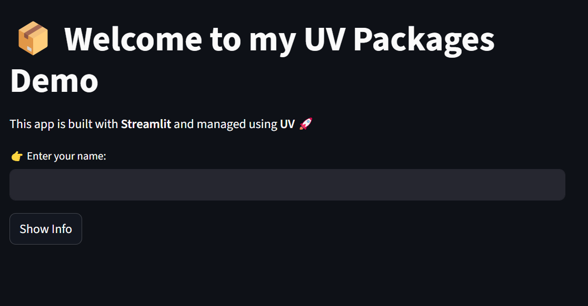
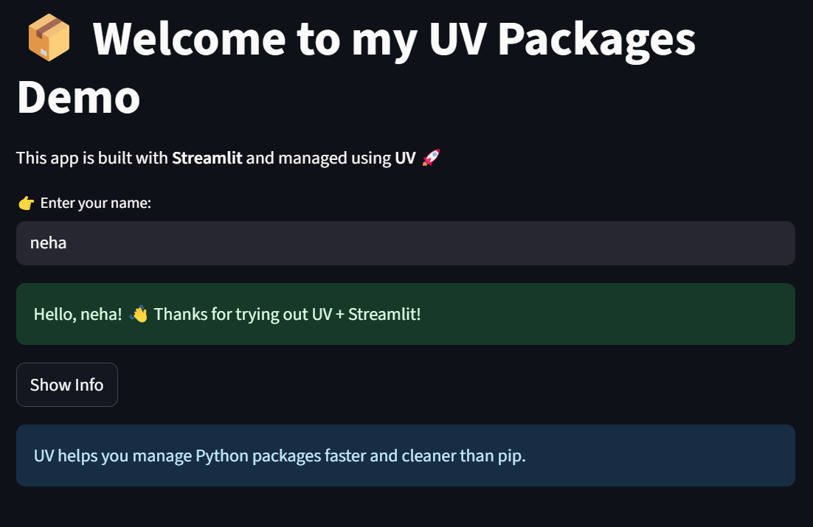

# uv_package_manager
A simple demo project using UV (fast Python package manager) with Streamlit 🚀.   This repo shows how to install packages, manage virtual environments, and run apps easily with UV.  

# UV package manager

- [UV package manager](https://github.com/astral-sh/uv)

**UV** is a fast and modern package manager for Python.  

## Why Install UV?
- 🚀 Faster than pip  
- 📦 Easy package management  
- 🌍 Works on Windows, Mac, Linux  
- 🔒 Clean virtual environments  

👉 Use UV to make Python setup **easy, fast, and reliable**.

## Installation

Install UV with our standalone installers:

### On macOS and Linux
```curl -LsSf https://astral.sh/uv/install.sh | sh ```  

### On Windows
```
powershell -ExecutionPolicy ByPass -c "irm https://astral.sh/uv/install.ps1 | iex"
```
### Usage
Initialize a new Python project in the current folder:

```uv init .```
#### Run your Python file using UV (without activating manually):

```uv run python main.py```

### Installing Packages

- There are two ways to install packages with UV:
- Add as a project dependency (recommended for projects, saves in pyproject.toml):

```uv add streamlit```

- Install like pip (quick use, without saving in project file):

```uv pip install streamlit```

## Virtual Environment

When you add a package, UV creates a local virtual environment called ```.venv/``` inside your project.
This keeps your project isolated from system Python.

### To activate the environment manually:
```
#  On macOS and Linux
source .venv/bin/activate 
```
```
# On Windows (PowerShell)
.venv\Scripts\activate
```

👉 Once activated, you can use ```python``` and ```pip``` inside this environment.

- Running Your Code

Run your Python file using UV (with activating manually):

```uv run python main.py```


Or run a package directly (example with Streamlit):

```uv run streamlit run main.py```


### Example Output

- After running uv init ., you’ll see something like:

✨ Created a new Python project!
📦 pyproject.toml
📂 .venv


After installing a package:

✔ Installed streamlit 1.x.x


Now you can run your Python app smoothly with UV 🚀

---
## 🖼️ Streamlit Demo
### Streamlit screenshot

